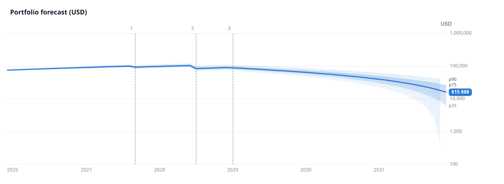

<div align="center">

# okama Planner

**Open-source personal and family financial planning powered by okama.**

[](https://github.com/mbk-dev/okama-planner/actions/workflows/ci.yml) [](pyproject.toml) [](LICENSE)

[Quick start](#quick-start) · [Reports & charts](#reports--charts) · [MCP](#use-with-an-ai-assistant) · [Client records](#client-records) · [Languages](#languages)

</div>



*Three goals, one household: **1 Car** (October 2029), **2 Home purchase** (October 2031),
**3 Early retirement** (October 2040). Forecast in USD through 2070, on a logarithmic scale;
blue median, shaded p25–p75 and p10–p90 ranges. Household inputs are fictional; returns use
frozen historical observations. Zero and negative values are not shown on a log axis.*

Build a monthly household plan, explore uncertainty, compare alternatives and export results
under your own brand. Designed for financial planners, technically comfortable individuals and
integration developers. Calculation quality comes first; Excel, charts and MCP provide ways to
use the application while a future web interface is explored.

## What you can do

| Task | Available today |
|---|---|
| Model a household | Income, expenses, assets, fixed-payment loans, reserves and dated goals |
| Choose a portfolio approach | One pooled portfolio or explicitly allocated portfolios for each goal |
| Compare plans | Shared market scenarios, goal funding, unmet payments and portfolio/capital outcomes |
| Present results | Configurable Excel reports and interactive offline HTML charts |
| Share visuals | PNG and SVG charts, goal markers and independent logarithmic scales |
| Automate calculations | Python API and optional tools in the existing okama-mcp server |
| Keep client history | Local SQLite registry, versioned plans, scenarios and saved results |

Separate goal portfolios share synchronized market scenarios. Fixed-rate savings accounts are
also supported, but are a different concept from investment portfolios for goals.
See [portfolio modes](docs/portfolio-modes.md) for allocation, transfers and funding rules.

## Quick start

Use **Python 3.11+** and [Poetry](https://python-poetry.org/). From a local source checkout:

```bash
git clone https://github.com/mbk-dev/okama-planner.git
cd okama-planner
poetry env use python3.11
poetry install --extras reports
poetry run python examples/demo.py
poetry run python examples/portfolio_modes.py
```

The first example compares a purchase now versus a deferred purchase. The second compares a
pooled portfolio with home and retirement portfolios on the same synthetic market scenarios.
Requests, results and an Excel comparison are saved under `tmp/`; neither example downloads
market data or needs a client database.

**Prefer to browse first?** Open the [saved family inputs](examples/family-single-request.json),
[results](examples/family-single-result.json) and [Excel report examples](https://github.com/mbk-dev/okama-planner/releases/tag/v0.4.0).
The [three-goal hero input](examples/readme-request.json) and [result](examples/readme-result.json)
are included with [dated assumptions and validation metadata](examples/readme-metadata.json).
The USD example uses 5,000 Monte Carlo paths; its independent validation estimates plan success
at 95.92% under the supplied assumptions. For exact numerical replay, use the versions in [examples/versions.json](examples/versions.json);
a seed alone does not freeze data or dependencies. [Calculation contract →](docs/contract.md)

### Use the Python API

```python
import json
from pathlib import Path
from okama_planner import forecast

request = json.loads(Path("examples/readme-request.json").read_text())
result = forecast(request)
```

The result is a JSON-compatible dictionary containing cash flows, goals, forecast metrics,
chart series and provenance. Complete input validation uses `ForecastRequest`; its JSON Schema
is available through `ForecastRequest.model_json_schema()`.

## Reports & charts

### Excel under your own brand

Set your company name, contacts, logo and accent color. The exporter creates a new workbook;
it does not require a private template or a pre-existing client file.

```python
from okama_planner.reports import ReportBrand, export_report

export_report(
    [{"label": "Family plan", "request": request, "result": result}],
    "family-plan.xlsx",
    brand=ReportBrand(company="Example Advisory", color="244C66"),
    language="en",  # en, ru, zh, de, es
)
```

| Workbook sections | What they show |
|---|---|
| Summary, Budget, Balance | Plan outcomes, planned monthly cash flows, portfolio and net capital |
| Goals, Assumptions, Comparison | Goal funding, model inputs and differences between scenarios |
| Ledger | Detailed planned cash-flow requirements |
| Segments, Allocation, Segment balances | Portfolio assignments, strategies and account projections |
| Funding events, Transfers | Actual funded/unmet payments and transfers in joint portfolio modes |
| Branding, Instructions | Your presentation settings and guidance for reading the workbook |

The optional sheets reflect the result schema and portfolio mode. Excel presents saved forecast
results: editing a cell does not rerun Monte Carlo. Change the input, recalculate and export again.
[Report details and fictional-brand examples →](docs/reports.md)

### Interactive and shareable charts

```python
from okama_planner.charts import export_charts

export_charts(result, "charts")                # offline interactive HTML
export_charts(result, "charts/png", format="png")
export_charts(result, "charts/svg", format="svg")
```

Portfolio and net capital are separate charts. HTML includes hover values, goal markers,
logarithmic-scale controls and image download buttons. Direct PNG/SVG rendering requires
Chrome or Chromium; HTML generation does not. This is a **chart export**, not a complete
HTML financial-plan report or a hosted web application. [Chart options →](docs/charts.md)

## Use with an AI assistant

Install Planner into the same environment as the existing **okama-mcp** server. Its current
source branch exposes `planner_forecast` and `planner_compare_modes`, while preserving the
existing portfolio tools. The adapter calls Planner rather than duplicating its calculations.

[Local installation, client setup and worked MCP examples →](https://github.com/mbk-dev/okama-mcp/blob/main/docs/planner.md)

Planner reports, chart rendering and consumption-utility helpers are not yet exposed through
these MCP tools. The published MCP package and public HTTP server have not been updated for
this integration; use the source installation described in the linked guide.

## Client records

**Designed for professional client work by financial advisors and financial planners.**
The local SQLite registry brings client identity, contacts, broker relationships and
planning history together: one stable client record is linked to multiple versions of
financial inputs, scenarios and saved calculations. It supports ongoing work with a client,
from collecting information and choosing how to communicate to revisiting their financial plan.

**Status: implemented in the Python API.** `okama_planner.storage` provides client
creation, reading and updates, financial versions, scenarios and saved forecast results.
The shipped SQLite template contains schema and zero client records, plans or results.
Access to this registry through okama-mcp is a separate planned integration.

```python
from pathlib import Path
from okama_planner.storage import PlannerStore

path = Path.home() / "planner-data" / "clients.sqlite3"
path.parent.mkdir(parents=True, exist_ok=True)
with PlannerStore.initialize(path) as store:
    assert store.list_clients() == []
```

`initialize` refuses to overwrite a file; `PlannerStore.open(path)` reopens an existing
database. [Storage API, versioned snapshots and migrations →](docs/storage.md)

### Complete client record

The table below shows **all 16 columns of Planner's `client_registry`**, with three entirely
fictional records. Fields run down the table so the complete record remains readable.
These examples exist **only in this README**, not in a bundled database or a seed script.
They illustrate the registry supported by the storage API.

| Field | Alex Morgan | Priya Rao | Jordan Lee |
|---|---|---|---|
| `id` — internal identifier | 1 | 2 | 3 |
| `code` — stable client code | c-0001 | c-0002 | c-0003 |
| `full_name` — full name | Alex Morgan | Priya Rao | Jordan Lee |
| `sex` — recorded sex | male | female | — |
| `birth_year` — year of birth | 1985 | 1990 | 1978 |
| `email` — email address | alex@example.invalid | priya@example.invalid | jordan@example.invalid |
| `phone` — telephone | — | — | — |
| `telegram` — Telegram handle | — | — | — |
| `telegram_id` — stable numeric Telegram ID | — | — | — |
| `whatsapp` — WhatsApp contact | — | — | — |
| `max_messenger` — MAX messenger contact | — | — | — |
| `brokers` — ordered broker list | ["Example Broker A"] | [] | — |
| `primary_channel` — main communication channel | email | email | email |
| `ips_sent_at` — date the investment policy statement was sent | 2026-09-15 | — | 2026-10-01 |
| `note` — advisor's working notes | Annual plan review | First planning meeting | Retirement scenarios |
| `created_at` — record creation timestamp (UTC) | 2026-09-01T09:00:00Z | 2026-09-08T10:00:00Z | 2026-09-20T08:30:00Z |

A dash means the value has not been recorded. For `brokers`, an empty list means the client
explicitly has no broker; a missing value means this is unknown. `primary_channel` points to
a contact that has been filled in. `telegram_id` preserves identity when a handle changes.
`ips_sent_at` records delivery of the investment policy statement, not automatic document creation.

### Identity, versions and planning history

The database separates the person from their changing financial information:

| Related table | All columns | Role in the advisor's workflow |
|---|---|---|
| `client` | `id`, `registry_id`, `version`, `source_digest`, `note`, `created_at` | A version of the client's financial inputs; linked by `registry_id`, with a source fingerprint |
| `tax_residency` | `id`, `registry_id`, `year`, `country`, `note` | Tax-residence country by calendar year, using an ISO two-letter country code |

Family members, assets, liabilities, budget items, goals, portfolios and scenarios belong to
versions of client financial data in Planner. Saved calculation runs hold the input snapshot and model settings.
This structure lets an advisor keep earlier inputs and compare later plans without treating
an updated financial situation as a different person. Recording tax residency does not itself
calculate jurisdiction-specific taxes.

Each advisor keeps their actual database outside the public repository. MCP access to the
registry remains planned; the storage API is implemented. Private advisory documents and internal
skills are not part of the public package.

## Languages

**Available today:** Excel reports and chart interface text in **English, Russian,
German, Spanish and Simplified Chinese** (`en`, `ru`, `de`, `es`, `zh`). Select a language
with `export_report(..., language="ru")` or `export_charts(..., language="ru")`.
The shared [terminology table](src/okama_planner/terminology.csv) supplies translated captions.
See the [five-language report example](examples/multilingual_reports.py).

The broader localization roadmap covers:

- Excel and future HTML/PDF report headings, sheet names, instructions and template text.
- Chart titles, controls, annotations and number, currency and date formatting.
- Client-registry field labels, descriptions, forms and user-facing views.
- Validation messages, tool descriptions shown by MCP clients, guides and demonstration materials.
- Future web interface labels and help text.

SQL column names, JSON keys and API identifiers will remain stable across languages.
Client names and other user-entered text are not automatically translated. Localized wording
does not imply support for a country's tax or pension rules. Additional languages and localization beyond the implemented
Excel/chart captions are roadmap items until their implementation is published.

## Model boundaries & next steps

The current model does not perform FX conversion or implement jurisdiction-specific taxes or
transaction fees. Inputs must already reflect externally modelled taxes and fees.
Monte Carlo probabilities describe the supplied model and assumptions, not guaranteed outcomes.

Retirement consumption **CE, gamma and equivalent-alpha helpers** exist as a separate module;
they are not yet integrated into forecasts, MCP or reports.
[Method and applicability →](docs/retirement-utility.md)

Next steps include registry access through MCP, broader MCP exports and multilingual presentation.
A web interface is a later direction. The standalone package contains no private client data,
MBK documents, internal skills or dependency on the closed lfp application.

Explore the family: [okama library](https://github.com/mbk-dev/okama) ·
[okama.io](https://okama.io/) · [okama-mcp](https://github.com/mbk-dev/okama-mcp).
